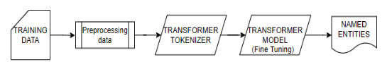
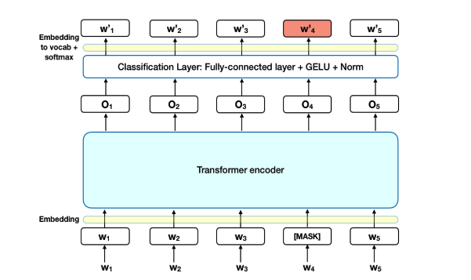

# BioBERT-based Named Entity Recognition (NER) on the Pubmed Dataset

This project demonstrates how to perform Named Entity Recognition (NER) on medical text by training BioBERT (a pre-trained language model for biomedical text mining) on the Pubmed dataset. The Pubmed dataset is a collection of biomedical research abstracts and articles, making it a valuable resource for NER tasks in the biomedical domain.

## Methodology

The overall architecture of the NER model as shown in the figure below, consists of preparing the bio-medical dataset for training, after which it will be passed on to the data preprocessing stage. Once, the data is converted into the necessary format according to the medical-NER task, it is then ready to be passed on to the transformer. The transformer’s tokenizer is first utilized to tokenize the input training data and convert it into a format that is compatible with the particular transformer in use. The tokenized input is further fed to the transformer model for fine-tuning to detect medical entities.



The BERT transformer architecture is given below



## Requirements

To run this project, you will need:

- Python 3
- PyTorch
- Transformers library
- Tqdm
- Scikit-learn
- Pandas

You can install the required dependencies by running:

```bash
pip install torch transformers scikit-learn pandas tqdm
```

## Getting Started

To use BioBERT for NER on the Pubmed dataset, you can follow these steps:

1. Download the Pubmed dataset from the official website: https://www.ncbi.nlm.nih.gov/dataset/docs/medline-tutorial/#:~:text=The%20PubMed%20MEDLINE%20Basics%20page%20provides%20links%20to,search%20Medline%20via%20the%20EBSCO%20host%20interface.%20
2. Convert the dataset to the CoNLL-2003 format using the script provided in this project.
3. Fine-tune the BioBERT model on the Pubmed dataset using the script provided in this project.
4. Evaluate the performance of the trained model on the test set using the script provided in this project.


## Files

All the code for this project resides in the ipython notebook. To run the project you will need the dataset to be downloaded from Pubmed.

## References

- BioBERT paper: https://arxiv.org/abs/1901.08746
- Pubmed dataset: https://pubmed.ncbi.nlm.nih.gov/
- CoNLL-2003 format: https://www.aclweb.org/anthology/W03-0419/